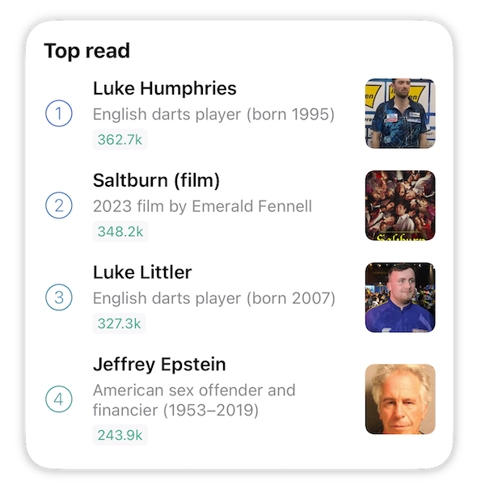

# Wikipedia Top Read Widget
Scriptable widget that exposes Wikipedia's Top Read API.

Inspired from the [original Wikipedia Top Read widget](https://design.wikimedia.org/blog/2021/04/26/bringing-wikipedia-to-the-homescreen-on-ios.html).

Originally found at https://gist.github.com/iiKurt/0c6d11d11590a781ea75ae2757fc13c3.

## Widget

## Running from Scriptable

## Features
- Runs via [Scriptable](https://scriptable.app)
- Supports all four sizes of widgets (small, medium, large, extra large)
- Direct linking to articles' pages on the widget
- A full list of the top 25 read articles by running the script directly or by tapping on the widget heading
- Article view counts
- Updates every ~8 hours to conserve energy

## TODO
- Article view count graph, like in the original widget
- Widget padding is a little strange on macOS
- Add some installation instructions here
